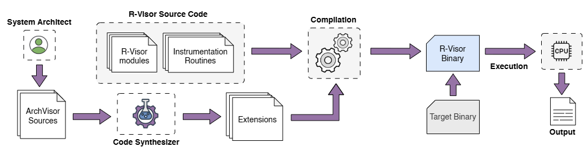

# Extensibility

**Arch-Visor** is a Domain-Specific Language (DSL) that enables extensibility in R-Visor by allowing users to define ISA extensions declaratively. It abstracts the instruction semantics, formats, and registers of a new ISA feature, and generates code that plugs into the R-Visor binary instrumentation tool without requiring manual modifications to its core.


## Purpose

Modern open ISAs like RISC-V frequently introduce new extensions. Traditional binary instrumentation tools, designed for closed ISAs, are hard to extend due to tightly coupled decoder, encoder, and context-switch logic. **Arch-Visor solves this** by offering a high-level interface to specify:

- Instruction formats (types, field encodings)
- Individual instructions
- Register files and associated loads/stores

These specifications are then used to **synthesize the necessary modules** (decoder, encoder, allocator support, etc.) for R-Visor.

---

## Compilation Flow

The figure below shows how Arch-Visor integrates with R-Visor's compilation flow:



> *Figure: Compilation flow integrating Arch-Visor with R-Visor.*

---

## Key Constructs

### 1. `InstType`
Defines the structure of an instruction, including bit ranges for opcode, immediate values, registers, etc.

```archvisor
InstType S {
  opcode       [0:6],
  imm(0:4)     [7:11] -s,
  funct3       [12:14],
  rs1          [15:19],
  rs2          [20:24],
  imm(5:11)    [25:31]
}
```

### 2. `Instruction`

Describes a specific instruction using a previously defined `InstType`. Optional `group` tags can be added for instrumentation hooks.

```archvisor
Instruction SW { type S, opcode 0b0100011, funct3 0b010, group SG }
Instruction SD { type S, opcode 0b0100011, funct3 0b011, group SG }
```

### 3. `RegFile`

Specifies a register file, load/store instructions, and register names — used for context switching and register introspection.

```archvisor
RegFile FP { size 32, load FLD, store FSD, F0, F1, F2, ..., F31 }
```

---

## Code Synthesis

The Arch-Visor **code synthesizer** reads the DSL specification and generates C modules for:

* The decoder (to recognize the new instructions)
* The encoder (to emit them)
* Context-switch logic (to handle register files)
* Instrumentation API hooks (to allow group/type-based instrumentation)

The synthesized code is compiled alongside the core R-Visor sources.

---


## ArchVisor's Grammar

```text
Grammar          := { InstTypeDecl | InstructionDecl | RegFileDecl }

InstTypeDecl     := InstType Identifier { FieldList }

FieldList        := Field | FieldList , Field

Field            := Identifier [ BitRange ]
                 | Identifier ( BitRange ) [ BitRange ] Tag

BitRange         := Integer : Integer | Integer

Tag              := - Identifier

InstructionDecl  := Instruction Identifier { type Identifier , FieldAssignmentList }

FieldAssignmentList := FieldAssignment
                     | FieldAssignmentList , FieldAssignment

FieldAssignment  := Identifier Integer

RegFileDecl      := RegFile Identifier { Load Identifier , Store Identifier , RegList }

RegList          := Identifier | Identifier , RegList

Identifier       := Letter | Identifier Letter
                 | Identifier Digit | Identifier _

Integer          := Digit | Integer Digit

Letter           := 'a'..'z' | 'A'..'Z'

Digit            := '0'..'9'
```


<br><br>


