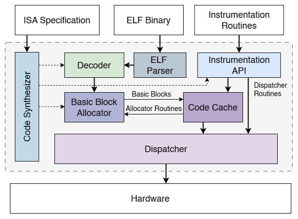

# Architecture

<!-- ## R-Visor Architecture -->
----
{ style="display:block; margin:auto;width:70%;" }
> *Architecture of R-Visor*
----

At the core of R-Visor is a Just-In-Time (JIT) execution engine which is responsible for dispatching instructions from the original binary to the hardware for execution. R-Visor manages the control flow of the application and executes any instrumentation routines at key points during execution which are determined by the user. Both R-Visor and the application being instrumented are executed in the same address space and appear as a single application by the Operating System. 

## ELF Reader and Decoder
R-Visor supports instrumetnation for files compiled in the Executable and Linkable Format ([ELF](https://man7.org/linux/man-pages/man5/elf.5.html)) which is a widely used binary format on Unix systems. R-Visor uses an ELF reader to interprete binaries to be instrumented. The ELF reader performs necessary sanity checks including:

* Verification that the input file is a valid ELF file.
* Verification that the binary is a RISC-V binary. 

Once the necessary requirements have been verified, the data sections of the binary such as **.bss**, **.rodata** and **.sbss** are extracted into a single memory block within R-Visor's memory. The **.text**, which contains the executable code, section is handled separately. Instructions from the text section are fed to R-Visor's RISC-V Decoder which translates them from the binary format into objects which can be interpreted by the Dispatcher.

## JIT Engine
The JIT engine consists of the Code Cache which is an mmap'ed executable region within R-Visor's address space. The default size of the Code Cache is 4MB. The JIT engine is also comprised of the Dispatcher which is responsible for executing the application code on the hardware. These two components work together to manage the execution and control flow of the instrumented binary. Once instructions are decoded, the JIT engine places them in the Code Cache as Traces. While the definition of a trace differs across literature, a trace in the R-Visor context can be one of the following:

* A basic block: A sequence of instructions ending in a control flow change instruction (a branch or jump).
* A sequence of instructions ending in a system call instruction
* A sequence of instructions preceding an instrumentation target
* A sequence of instructions with a fixed length

R-Visor places extra code for a context switch at the end of each basic block, in order for control to return to R-Visor after the block executes. Once this context switches happens, the Dispatcher determines first

* Executes any required instrumentation routines
* Selects the next trace to be executed based on the last instruction of the just-ended trace and places the trace in the code cache if not already present 
* Performs a context switch to the code cache location of the next trace.

These processes are conducted in an unobtrusive manner, ensuring that the instrumented binary remains unaware of the modifications or observations being made during execution. The register state of the original application is also preserved during these processes. 

Since context switching after every trace incurs extra overhead, an [optimization](../trace_linking) is included to reduce the context switch rate. In order to ensure that R-Visor would function efficiently on memory constrained systems, the code cache also contains an [optimization](../stub_regions) to reduce the amount of extra code that R-Visor inserts into the code cache. 

## System Calls
In RISC-V, the `ECALL` instruction is used to request a service from the Operating System. In order to maintain address transparency, certain modifications would need to be made to the system call parameters. Moreover, certain system calls such as `exit()` would affect the state of both the target binary and R-Visor itself. Due to these reasons, we choose to emulate some of the system calls executed by the binary. Thus, a trace is also terminated before a system call instruction for a context switch to be made to R-Visor.

  