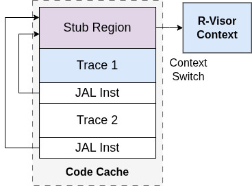

# Stub Regions

{ style="display:block; margin:auto;width:50%;" }
<!-- **Figure 1:** Stub regions in R-Visor -->
> *Stub Regions in R-Visor*

----


The traces in the code cache consist of basic blocks taken directly from the binary and extra code added by R-Visor. The additional code performs two functions: 
* It maintains address transparency when loads, stores, or AUIPC instructions are used, and
* invokes context switches back to R-Visor. The latter, which occurs in the stub, consists of code to 
    - save a register to the stack, 
    - load the address of the context switch function, and 
    - jump to that address. 

Placing this stub after each basic block would quickly accumulate into a lot of code within the code cache. However, since stub code is identical for all basic blocks in most cases, multiple basic blocks can share the same stub code within the code cache. We implemented stub regions to reduce the memory overhead caused by placing the stub after each basic block. 

Stub regions are specific regions within the code cache where R-Visor places stub code, accessible by multiple basic blocks. These basic blocks are terminated by a direct jump (JAL), whose target is the nearest stub region. The interval between each successive stub region is determined by the range of the JAL instruction (1024 instructions), with some additional tolerance added. This optimization is configurable and recommended for situations with a high constraint on memory.


----

## Using Stub Regions

Stub Regions can be enabled in the routines by adding the `-DSTUBREGIONS` flag in the CMakeLists.txt. The full modification is as follows:

```cmake
# Old
# set(CMAKE_C_FLAGS "${CMAKE_C_FLAGS} -O3 -g -march=rv64imafd -mabi=lp64d -mno-relax")

# New
set(CMAKE_C_FLAGS "${CMAKE_C_FLAGS} -DSTUBREGIONS -O3 -g -march=rv64imafd -mabi=lp64d -mno-relax")
```

----


<br><br>
