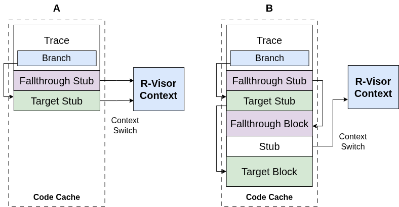

# Trace Linking

----
{ style="display:block; margin:auto;width:70%;" }
> *Trace Linking in R-Visor*

----

## Description
During binary execution, R-Visor regains control under the following scenarios:
* The next basic block is not already in the code cache.
* The dispatcher cannot statically determine the target of a control-flow instruction during Basic Block (BB) allocation.
* R-Visor needs to execute an instrumentation routine.

In the absence of these conditions, the basic blocks can be connected directly in the code cache, minimizing the overheads associated with context switches back to R-Visor. We use this ideology for our version of trace linking. Separate algorithms are used by R-Visor to achieve trace linking for direct jumps and branches. However, these internal mechanisms are abstracted from the user to simplify the R-Visor API.

## Use Case
To measure the impact of trace linking, we will execute a **no_instrumentation** routine (a routine that performs no explicit instrumentation actions) with and without trace linking enabled. This will be done by measuring the execution cycles and instruction count, through RISC-V's Hardware Performance Counters (HPCs).

### Measuring metrics without trace linking
By default, trace linking is often disabled in R-Visor. We can enable the recording of metrics by modifying the **CMakeLists.txt** file.

1.  **Enable Metrics Flag:**
    Insert the `-DMETRICS` flag into your C compilation flags. This allows conditional compilation of code sections designed for metric collection.
    ```cmake
    # CMakeLists.txt

    # Add -DMETRICS to CMAKE_C_FLAGS
    set(CMAKE_C_FLAGS "${CMAKE_C_FLAGS} -g -DMETRICS -march=rv64imafd -mabi=lp64d -mno-relax")
    ```

2.  **Specify Executable:**
    Ensure that the executable being built is the `no_instrumentation.c` routine. Create `routines/no_instrumentation.c` with basic R-Visor setup but no actual instrumentation calls (or a minimal exit routine if METRICS is defined).
    ```cmake
    # CMakeLists.txt

    add_executable(no_instrumentation ${ROUTINESDIR}/no_instrumentation.c ${HEADER_FILES})
    ```
    A minimal `routines/no_instrumentation.c` for metrics might look like this:
    ```c
    #include <stdio.h>
    #include <stdlib.h>
    #include "../src/rail.h"   // Core R-Visor API
    #include "../src/logger.h"  // For set_logging_file, rvisor_logger

    #ifdef METRICS
        static uint64_t start_cycle, end_cycle;
        static uint64_t start_instr, end_instr;

        void exit_routine_metrics_no_instr(uint64_t *regfile) {
            asm volatile ("csrr %0, instret" : "=r"(end_instr));
            asm volatile ("rdcycle %0" : "=r"(end_cycle));
            fprintf(rvisor_logger, "Total elapsed cycles: %lu\n", (unsigned long)(end_cycle - start_cycle));
            fprintf(rvisor_logger, "Total instructions executed: %lu\n", (unsigned long)(end_instr - start_instr));
            if (rvisor_logger) fclose(rvisor_logger);
        }
    #endif

    int main(int argc, char** argv, char** envp) {
        if(argc < 2) {
            printf("Please provide a target binary\n");
            exit(1);
        }
        set_logging_file("no_instrumentation_logs.txt", "w");
        rvisor_init(argv[1]);
        rvisor_register_args(argc, argv, envp);
    #ifdef METRICS
        rvisor_register_exit_routine(exit_routine_metrics_no_instr);
        asm volatile ("rdcycle %0" : "=r"(start_cycle));
        asm volatile ("csrr %0, instret" : "=r"(start_instr));
    #endif
        rvisor_run();
        return 0;
    }
    ```

3.  **Build the Binary:**
    ```bash
    cmake .
    make
    ```
    Running `make` will build a binary named `no_instrumentation` in your build's output directory (e.g., `./bin/no_instrumentation`).

4.  **Execute and Collect Metrics:**
    Execute this binary, instrumenting a benchmark like `stream`:
    ```bash
    qemu-riscv64 ./bin/no_instrumentation benchmarks/stream
    ```
    The metrics would be stored in `no_instrumentation_logs.txt`:
    ```
    Total elapsed cycles: 3623305178
    Total instructions executed: 3623305172
    ```
    *(These are example values; actuals will vary.)*

### Measuring metrics with trace linking
To measure the impact of trace linking, we will create a new C file, `routines/no_instrumentation_tl.c`. The key change is enabling trace linking.

1.  **Create `no_instrumentation_tl.c`:**
    This file will be very similar to `no_instrumentation.c`, but with trace linking explicitly enabled using the R-Visor C API.

    ```c
    // routines/no_instrumentation_tl.c
    #include <stdio.h>
    #include <stdlib.h>
    #include "../src/rail.h"   // Core R-Visor API
    #include "../src/logger.h"  // For set_logging_file, rvisor_logger

    #ifdef METRICS
        // These should be declared to be accessible by the exit routine
        static uint64_t start_cycle, end_cycle;
        static uint64_t start_instr, end_instr;

        // Exit routine to print metrics
        void exit_routine_metrics_tl(uint64_t *regfile) {
            asm volatile ("csrr %0, instret" : "=r"(end_instr));
            asm volatile ("rdcycle %0" : "=r"(end_cycle));
            if (rvisor_logger) { // Check if logger is open
                fprintf(rvisor_logger, "Total elapsed cycles: %lu\n", (unsigned long)(end_cycle - start_cycle));
                fprintf(rvisor_logger, "Total instructions executed: %lu\n", (unsigned long)(end_instr - start_instr));
                fclose(rvisor_logger);
            }
        }
    #endif

    int main(int argc, char** argv, char** envp) {
        if(argc < 2) {
            printf("Please provide a target binary\n");
            exit(1);
        }

        // Change the name of the logging file so that we do not
        // overwrite the old metrics
        set_logging_file("no_instrumentation_tl_logs.txt", "w");
        
        // Enable trace linking by setting the global flag BEFORE rvisor_init
        rvisor_trace_linking_enabled = 1; 

        rvisor_init(argv[1]);
        rvisor_register_args(argc, argv, envp);

        #ifdef METRICS
            rvisor_register_exit_routine(exit_routine_metrics_tl);
            // Record start time/instructions just before running the instrumented code
            asm volatile ("rdcycle %0" : "=r"(start_cycle));
            asm volatile ("csrr %0, instret" : "=r"(start_instr));
        #endif
        
        rvisor_run();
        return 0;
    }
    ```

2.  **Modify `CMakeLists.txt` to build `no_instrumentation_tl.c`:**
    ```cmake
    # CMakeLists.txt

    # Add this line for the trace-linked version
    add_executable(no_instrumentation_tl ${ROUTINESDIR}/no_instrumentation_tl.c ${HEADER_FILES})
    ```

3.  **Build the Binary:**
    ```bash
    # You might need to run 'cmake .' again if you added a new executable
    cmake . 
    make
    ```
    Running `make` will build a binary called `no_instrumentation_tl`.

4.  **Execute and Collect Metrics with Trace Linking:**
    Once again, execute this binary while instrumenting the `stream` benchmark:
    ```bash
    qemu-riscv64 ./bin/no_instrumentation_tl benchmarks/stream
    ```
    The metrics would be stored in `no_instrumentation_tl_logs.txt`:
    ```
    Total elapsed cycles: 505284725
    Total instructions executed: 505284719
    ```
    *(These are example values; actuals will vary.)*

After comparing the results from `no_instrumentation_logs.txt` and `no_instrumentation_tl_logs.txt`, it is evident that there can be a very large improvement in the cycle and instruction count (e.g., ~85% reduction in the example numbers) when trace linking is enabled for scenarios with minimal R-Visor intervention.

## Conclusion
Although we have demonstrated that trace linking significantly improves the computation performance of a binary being instrumented (when no frequent C routines are called), this was shown without complex instrumentation routines present at high frequency (e.g., per basic block). By default, if C-based instrumentation routines are registered to run at every basic block or instruction, they require a context switch to R-Visor. Thus, the benefits of using trace linking would be diminished in such cases. To overcome this and maintain performance even with frequent, short instrumentation tasks, R-Visor implements another optimization called [routine inlining](../inlining).

<br><br>


